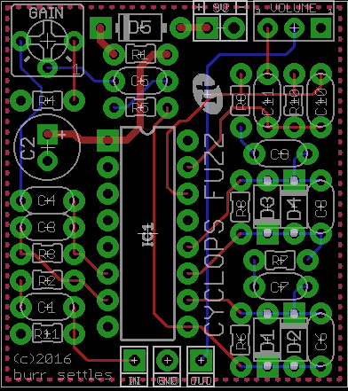

CYCLOPS
=======

**MUFFLIKE FUZZ**

© 2016 burr settles

### overview

CYCLOPS is an in-your-face, no-holds-barred, wall-of-sound machine in a tiny little box. It is based on the [runoffgroove 22/7](http://runoffgroove.com/22-7.html), which in turn is a CMOS implementation of the [EHX Big Muff Pi](https://en.wikipedia.org/wiki/Big_Muff). However, CYCLOPS has been modified to have nothing but a VOLUME control: the tone stack has been removed (no more scooped mids!), and the gain/sustain is designed to be an internal trimmer; just to "set it and forget it" to taste.

### notes

* The clipping diodes (D1-D4) can be anything you want, though 1N914 is common in BMP clones. In my build, I ended up using 3mm red LEDs for D1-D2, and 1N4148s for D3-D4.
* The GAIN knob is layed out as a trimmer, but you can wire it to an offboard pot if you prefer.
* IC1 pins 2, 4, 13, and 16 are not connected.

### bill of materials

Qty | Parts | Value
--- | ----- | -----
1 | C1 | 47n film
1 | C2 | 100u electrolytic
1 | C3 | 220p ceramic
5 | C4, C5, C7, C9, C11 | 100n film
3 | C6, C8, C10 | 150p ceramic
4 | D1, D2, D3, D4 | your choice
1 | D5 | 1N5417
1 | IC1 | CD4049 hex-inverting buffer
3 | R1, R2, R9 | 100k
4 | R3, R6, R8, R11 | 1M
1 | R4 | 1k
2 | R5, R7 | 33k
1 | R10 | 330k
1 | GAIN | 100kA (trimmer)
1 | VOLUME | 100kA

### schematic

### layout

1.3" x 1.46" (1590a)

