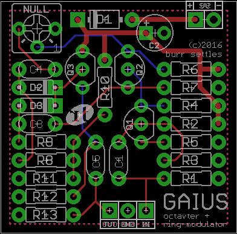

GAIUS
=====

**OCTAVER / RING MODULATOR**

© 2016 burr settles

### overview

GAIUS is based on the [dan armstrong green ringer](http://www.effectsdatabase.com/model/danarmstrong/greenringer) with an added NULL control to vary the intensity of the effect.

When playing a single note, it doubles the tone one octave up; but if playing two notes, it will produce sum and different tones like a ring modulator. Depending on the interval between the two notes, the additional tones will be harmonically related to the original notes (such as sub octaves) or dissonant. The added NULL pot varies the intensity of the effect: fully clockwise is the stock circuit; dialing it back will make the circuit less symmetrical and dampen the effect.

### notes

* The NULL pot is layed out as a trimmer for flexibility: may want to mount a control off-board, or just use a trimmer to "set it and forget it." A 500kC pot for a wider range in the effect. Personally I think the listed value provides enough range. If you want to omit this control altogether, simply jumper pins 2 and 3.
* For the clearest octave effect, match diodes D2-D3 as closely as possible for forward voltage, as well as the resistors R6-R7 (10k) and R10-R11 (22k). Although if you use 1% metal film they're probably going to be extremely close anyway.
* Other diodes may work for D2-D3, so long as they are a closely matched pair.

### schematic

### bill of materials

Qty | Parts | Value
--- | ----- | -----
3 | C1, C3, C4 | 47n film
1 | C2 | 100u electrolytic
1 | C5 | 100n film
1 | D1 | 1N5817
2 | D2, D3 | 1N914 (or other matched pair)
2 | Q1, Q3 | 2N5088 (or 2N5089)
1 | Q2 | 2N3906 (low-gain PNP)
1 | R1 | 1M
2 | R10, R11 | 22k
1 | R13 | 47k
1 | R2 | 470k
1 | R3 | 160k
1 | R4 | 18k
1 | R5 | 6k2
3 | R6, R7, R12 | 10k
2 | R8, R9 | 68k
1 | NULL pot | 100kB (or 500kC)

###

