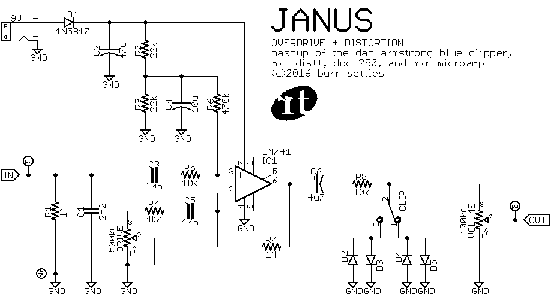
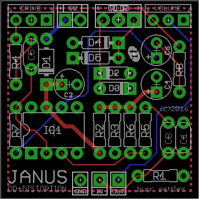

JANUS
=====

**OVERDRIVE + DISTORTION + BOOST**

© 2016 burr settles

### overview

JANUS is a versatile and open-ended dirt box. It is a mash-up of several classic 1970s distortion circuits, starting with the [Dan Armstrong Blue Clipper](http://www.effectsdatabase.com/model/danarmstrong/blueclipper) (1972) which was supposedly one of the first op-amp-based "smooth fuzz" effects. As legend has it, someone from MXR picked one of these up at a NAMM convention, which inspired the [MXR Distortion+](https://en.wikipedia.org/wiki/MXR_Distortion_%2B) (1973), which in turn was adapted into both the [DOD 250 Overdrive/Preamp](http://www.effectsdatabase.com/model/dod/first/250) (1976) and the [MXR MicroAmp](http://www.jimdunlop.com/product/m133-micro-amp) (a booster pedal, not a distortion).

Since these are all essentially the same circuit with a few different values, the same board will let you build pretty much any of them. JANUS uses a combination of values I came to like through experimentation, and adds a CLIP switch to toggle between different clipping diodes (or no diodes at all). This makes JANUS a multi-faced, multi-purpose vintage distortion box packed into in a small package.

### notes

* The clipping diodes (D1-D4) are your choice. Feel free to experiment. In my build, I used a pair of 1N914s for D2-D3 (symmetrical), and a 3mm red LED coupled with a NOS germanium for D4-D5 (asymmetrical).
* If you use an on/off/on SPDT for the CLIP switch, the "off" position adds a third "dirty boost" option. (The op-amp can be overdriven without the help of clipping diodes... although be prepared as it's a _lot_ louder!)
* Alternatively, if you don't want a CLIP switch, you can either:
  1. jumper pin 2 to pin 1 and use D4-D5 (larger, 4-spaced diodes like germanium or Schottky), or
  2. jumper pin 2 to pin 3 and use D2-D3 (smaller, 3-spaced diodes like 1N914, 1N4148, or LEDs).
* If you want to omit the DRIVE control (e.g., a Blue Clipper clone), jumper pin 2 to 3. This is fixed at maximum gain.
* If you want to build a dirty boost with one control (e.g., a MicroAmp clone), jumper pin 2 to 3 for the VOLUME pot, and use only the DRIVE control. (You may also want to add a 10k resistor from pin 1 to either 2 or 3 to be faithful to that circuit).

### bill of materials

I recommend building with the JANUS values, those are the only ones I have tested.

Since I edited the circuit to my own liking and squeezed it all into a 1590a-sized board, I omited some components for some of the source circuits, and you can't get a 100% faithful clone of all the circuits JANUS is based on. However, if you still prefer to try a straight-up clone of one of the source effects, you can try the alternate component values below:

Part | **JANUS** | [Blue Clipper](http://tonepad.com/project.asp?id=49) | [Distortion+](http://tonepad.com/project.asp?id=2) | [DOD 250](https://sites.google.com/site/snmavronis/NeoClassicFX/741overdrive/research) | [MicroAmp](http://electrosmash.com/mxr-microamp)
--- | --- | --- | --- | --- | ---
C1 | **2n2** | - | 1n | - | -
C2 | **47u** | 100u | - | - | -
C3 | **10n** | 47n | 10n | 10n | 100n
C4 | **10u** | - | 1u | 10u | 1u
C5 | **47n** | 4u7 | 47n | 47n | 4u7
C6 | **4u7** | 4u7 | 1u | 4u7 | 15u
D1 | **1N5817** | - | - | - | -
D2-D3 | **your choice** | 1N914 (Si) | - | 1N4148 (Si) | -
D4-D5 | **your choice** | - | 1N270 (Ge) | - | -
IC1 | **LM741** | LM741 | LM741 | LM741 | LM741
R1 | **1M** | - | - | - | -
R2 | **22k** | 200k | 1M | 22k | 100k
R3 | **22k** | 240k | 1M | 22k | 100k
R4 | **4k7** | 150R | 4k7 | 4k7 | 2k7
R5 | **10k** | jumper | 10k | 10k | 10k
R6 | **470k** | jumper | 1M | 470k | 10M
R7 | **1M** | 150k | 1M | 1M | 56k
R8 | **10k** | 18k2 | 10k | 10k | 470R
CLIP | **SPDT** toggle | jumper 2-3 | jumper 2-1 | jumper 2-3 | -
DRIVE | **500kC** | jumper 2-3 | 500kC | 500kC | 500kC
VOLUME | **100kA** | 10kA | 50kA | 100kA | jumper 2-3

### schematic

### layout

1.3" x 1.3" (1590a)

