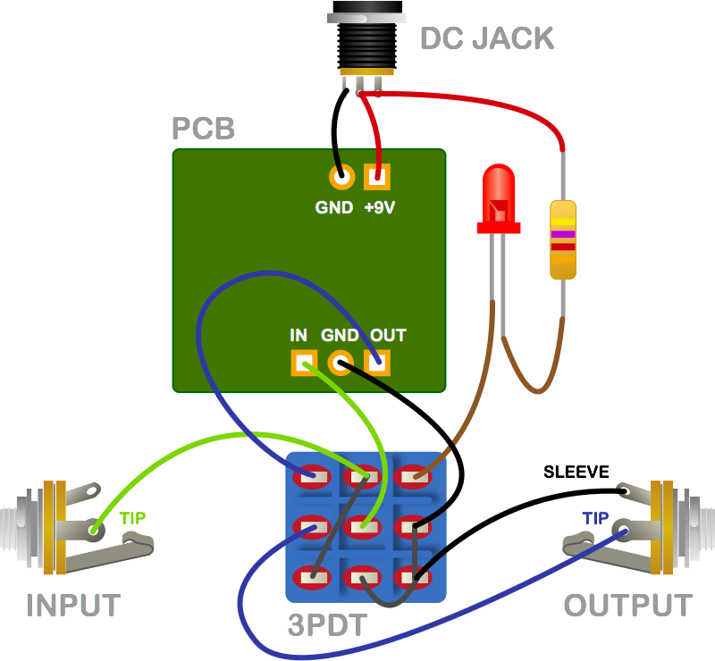

# BULLFINCH EFFECTS

This repo contains work-in-progress circuit designs for DIY guitar effect pedals.

I write songs and play guitar for [delicious pastries](https://soundcloud.com/deliciouspastries/albums); as our sound has became more effects-driven, I became interested in the underlying technology of  analog effects. So I built a few boutique pedals/clones from stompbox kits and PCBs designed by others. I'm now at a point where I want to experiment with my own circuit modifications, designs, and layouts. This is a playground for that.

### 1590a pedals (small enclosure)

- CERBERUS (frequency range booster)
- [CYCLOPS](1590a/cyclops_fuzz/) (mufflike fuzz)
- [GAIUS](1590a/gaius_ringer/) (octaver / ring modulator)
- [JANUS](1590a/janus_overdrive) (overdrive + distortion)
- PHRIKE (tremolo)
- SIREN (PT2399 chorus)
- SQUONK (envelope filter / autowah)

### 1590b pedals (medium enclosure)

- BACCHUS (classic fuzz)
- CHIMERA (chorus/vibrato)
- GEMINI (phaser)
- TITAN (supa-muff fuzz)

Subfolders contain files for [EAGLE](http://www.cadsoftusa.com/) schematics and two-sided circuit boards (e.g., for an [OSH Park](https://oshpark.com/) order), and maybe some documentation. The `bffx-lbr` directory contains the EAGLE library I'm using. I am not making any one-sided layouts, since I don't want to etch my own PCBs (for now). At this point, no designs are verified or even finalized. As time goes on, I will actually build and test these, and documentation will be more complete! :)

I'm naming the pedals after various mythological characters.

### wiring diagram

© 2016 Burr Settles ([LICENSE](LICENSE.md))