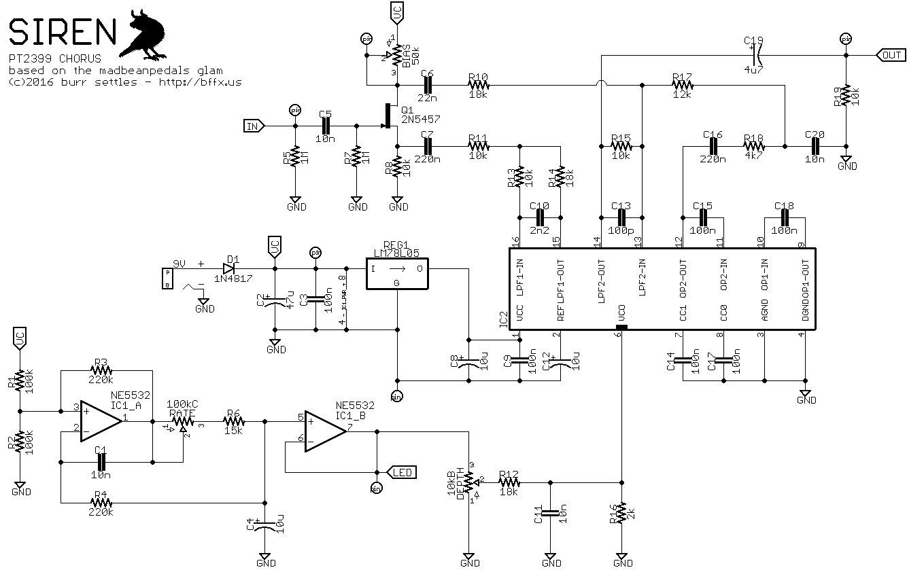

# SIREN

**PT2399 CHORUS**

© 2016 Burr Settles ([LICENSE](../../LICENSE.md))

### overview

SIREN is a tiny chorus pedal based on the [MBP Glam](http://madbeanpedals.com/projects/1590G/Glam.pdf), which in turn was inspired by the [Little Angel](http://www.diystompboxes.com/smfforum/index.php?topic=86297.0) and several other attempts to use a modulated PT2399 delay chip to create a chorus effect. The end result doesn't feel like a "true" chorus — in fact it's a bit like a cross between a slapback delay and a chorus. But and interesting effect nonetheless.

I redesigned the circuit to fit in a 1590a enclosure, with a few other tweaks (optional trimpot for depth control, pulsing rate indicator LED, etc.). Here are the results!

### notes

* The board was designed for 1/8W resistors (2-hole spacing)
* The `DEPTH` pot is laid out for an internal trimpot ("set it and forget it"), as I used it in my build below. However, you can easily wire it up as an off-board depth control if you wish.
* If you want the indicator LED to pulse with the LFO/rate, just connect the LED anode via a current-limiting resistor to the `L+` pad (instead of directly to the 9V+ power source). Connect the cathode to the footswitch as normal.

### bill of materials

Qty | Parts | Value
--- | ----- | -----
4 | C1, C5, C11, C20 | 10n
1 | C2 | 47u
6 | C3, C9, C14, C15, C17, C18 | 100n
2 | C4, C12 | 10u
1 | C6 | 22n
2 | C7, C16 | 220n
1 | C8 | 10u
1 | C10 | 2n2
1 | C13 | 100p
1 | C19 | 4u7
2 | R1, R2 | 100k
2 | R3, R4 | 220k
2 | R5, R7 | 1M
1 | R6 | 15k
5 | R8, R11, R13, R15, R19 | 10k
3 | R10, R12, R14 | 18k
1 | R16 | 2k
1 | R17 | 12k
1 | R18 | 4k7
1 | D1 | 1N4817
1 | IC1 | NE5532
1 | IC2 | PT2399TH
1 | Q1 | 2N5457
1 | REG1 | LM78L05
1 | POT: BIAS | 50k (trim)
1 | POT: DEPTH | 10kB
1 | POT: RATE | 100kC

### schematic

### layout

1.3" x 2.1" (1590a)

### build pic

29 May 2017
